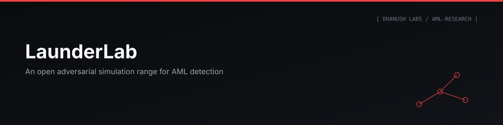

<p align="center"></p>


### An Open Adversarial Range for AML Detection

A self-contained synthetic bank where an automated red team invents money-laundering schemes and a four-layer detection stack has to catch them — and both sides evolve against each other. Built by **Dhanush Jangadi**. All data synthetic; all typologies drawn from public FATF / FinCEN / RBI advisories.

**[▶ Launch the interactive research site →](https://dhanu2626.github.io/launderlab/)** — replay a laundering scheme day by day, watch detection close in, read every result with its methodology and limits. No install.

---

## Problem Statement

> [!IMPORTANT]
> AML detection is evaluated almost entirely in private. Vendors publish recall figures against proprietary datasets; banks can't measure what their own stack missed, because no bank knows what it missed. LaunderLab generates ground truth for every transaction, so every number below is a **measurement**, not a claim.

The one experiment that matters most — what happens when the adversary adapts — is normally run behind closed doors, if at all. LaunderLab runs it in the open.

## Architecture

```
RED TEAM ──launders through──► SYNTHETIC BANK ──transactions──► BLUE TEAM
   ▲                                                                │
   └──────────────── mutates strategy from misses ◄─────────────────┘
                                                       alerts ──► INVESTIGATOR WORKBENCH
```

| Phase | Subsystem | Result |
|---|---|---|
| 0–1 | World engine | 10,000 customers, 630,755 transactions in 31s, fully reconciled |
| 2 | Typology injector | 6 typologies, each writing ground truth |
| 3 | Rules engine | 6 tunable scenarios |
| 4 | Screening | 100% recall, 75.0% precision (measured, see below) |
| 5 | Graph analytics | 15/15 mule networks reconstructed, 100% precision |
| 6 | ML tournament | 6 model families, one leaderboard |
| 7 | Investigator workbench | Alert queue → entity 360 → link graph → SAR draft |
| 8 | Red-team decay benchmark | Non-uniform decay across typologies |
| 8.5 | Multi-bank blind spot | Cross-bank chain reconstruction, 0–6% solo, 69–81% cooperative |
| 9 | Story Mode | Day-by-day replay with detection latency |

## How It Works

```bash
python -m venv .venv
.venv\Scripts\python -m pip install -e ".[dev,api]"
.venv\Scripts\python -m launderlab demo-world
set LAUNDERLAB_DB=data\demo.duckdb
.venv\Scripts\python -m uvicorn launderlab.workbench.api:app --port 8787
```

`demo-world` builds 1,200 accounts / 78,556 transactions, injects all six typologies, runs the full stack, and opens the workbench at `http://127.0.0.1:8787/` in ~20s.

## Features

- **Red team that adapts** — one adversary genome per typology mutates its parameters generation over generation based only on public knowledge (never reads ground truth).
- **Four-layer detection stack** — rules engine, sanctions/PEP fuzzy screening, graph analytics, six-model ML tournament.
- **Investigator workbench** — alert queue tiered by evidence type → entity 360 → link graph → SAR narrative draft (template-based, not LLM-generated, deliberately — see Engineering Decisions).
- **AML MCP server** — exposes the ledger to Claude Code/Desktop over MCP with six narrow, read-only, audited tools (no raw-SQL tool, by design).
- **Story Mode** — replay any scheme day-by-day; accounts light up only when a real detector fires, never because they're in the answer key.

## Screenshots

> [!NOTE]
> Add real captures here from Story Mode, the workbench queue, and a `charts/` output — placeholders only for now.

## Interactive Demo

**[dhanu2626.github.io/launderlab](https://dhanu2626.github.io/launderlab/)** — built via `python -m launderlab publish`, which collects every chart into `docs/`, all on the same scoring modules the CLI uses, so a published figure can't drift from what's graded.

## Engineering Decisions

| Question | Answer |
|---|---|
| Detection decay — how fast does a stack rot against an adapting adversary? | Non-uniform. `shell_company` collapses to 0% recall by generation 2 and stays there; `structuring` and `round_tripping` never fully evade across 8 generations. |
| False-positive economics — what does a true alert cost? | Measured, not guessed: at a budget of 50 alerts, 1.25 reviews per true find. |
| The cross-bank blind spot — what can one bank not see? | Banks flag 75–77% of individual mule accounts but reconstruct only 0–6% of the chains they form. Privacy-preserving cooperation on HMAC'd references recovers 69–81%. |

> [!WARNING]
> Combining all four detection layers into one blended score does **not** outrank the best single layer — screening dilutes it. Adverse media, as a scoring signal, adds zero true positives at any weight and was rejected. Both findings are reported rather than hidden.

Every judgment call (deadline definitions, which flows are excluded, how ambiguity defaults) is written down with its residual risk in `rules/DECISIONS.md`.

## Project Structure

```
launderlab/
├── src/launderlab/        world engine, injector, detection layers, workbench, MCP server
├── data/                  synthetic ledgers (DuckDB)
├── charts/                generated result charts
├── docs/                  published GitHub Pages site
└── tests/                 311 tests, 0 skips
```

## Tech Stack

Python · DuckDB · FastAPI/Uvicorn · MCP (Model Context Protocol) · pytest

## Results

| Typology | Days to first alert | % already moved |
|---|---|---|
| dormant_reactivation | 0 | 100% |
| high_risk_geography | 0 | 60% |
| layering | 1 | 46% |
| round_tripping | 4 | 100% |
| shell_company | 6 | 58% |
| structuring | 9 | 47% |

Screening: **100% recall / 75.0% precision** on a realistic name-diversity pool (up from 29.4% precision on a narrow pool — 86% of that gap was collision density in generated data, measured via a controlled two-arm experiment, not assumed).

## Future Improvements

- Additional bank statement / watchlist formats (real OFAC/UN/EU data, not synthetic)
- Average red-team convergence over multiple seeds, not one
- Whether trained ML models decay faster or slower than rules under the same adversary
- A real cooperation protocol addressing the two disclosed residual leaks (graph shape, full payment history of flagged accounts)

## Lessons Learned

Five defects surfaced only by putting a number in front of a human, not by tests: a rule-strength formula that silently capped a confirmed structuring scheme below the alert threshold; a 100-row pagination default that truncated the evidence an analyst was reading; risk bands where "critical" described nothing because the scale assumed all four layers firing at once; a screening-score ceiling that dropped every non-perfect name match before it reached an analyst; and a ratio-based rule that fired on all five shell-company schemes and then went **silent again** on three of them as ongoing legitimate income diluted the shell's share back under the threshold — so a scheme detectable on the 9th was invisible on the 31st, and any end-of-period score under-counts ratio rules. All passed a full test suite. The pattern: **detection metrics grade a detector against ground truth — nothing grades whether its output is usable.**

## License

MIT

## Contact

Dhanush Jangadi — [GitHub](https://github.com/Dhanu2626) · [LinkedIn](https://www.linkedin.com/in/jangadidhanush)

---
<p align="center"><sub>Part of the <b>Dhanush Labs</b> portfolio · engineered by <a href="https://github.com/Dhanu2626">Dhanush Jangadi</a></sub></p>
